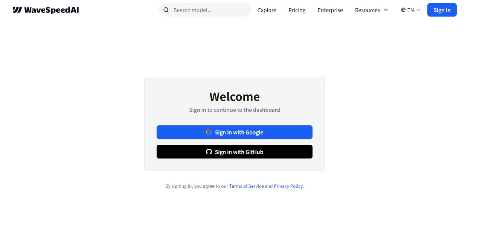
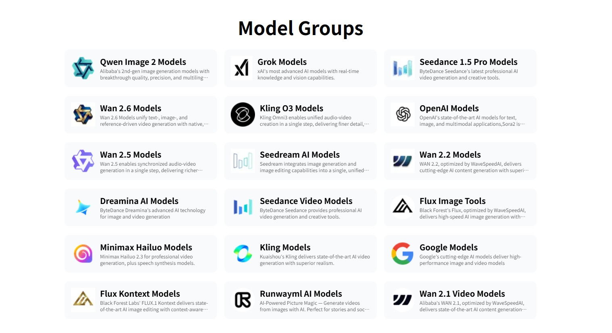
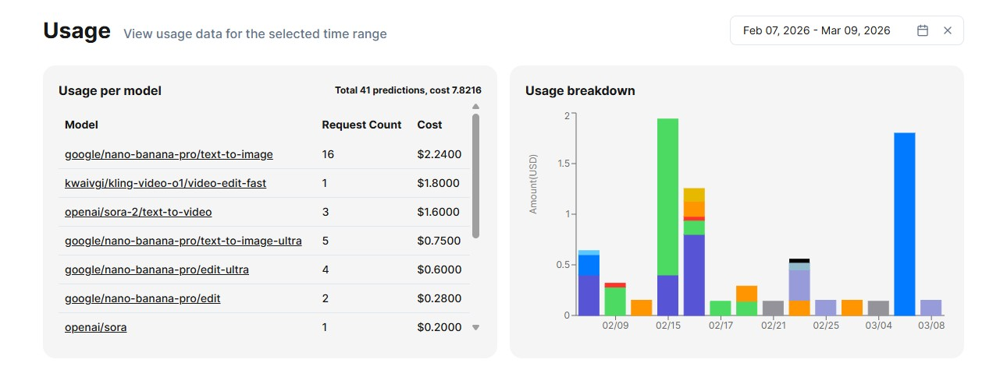
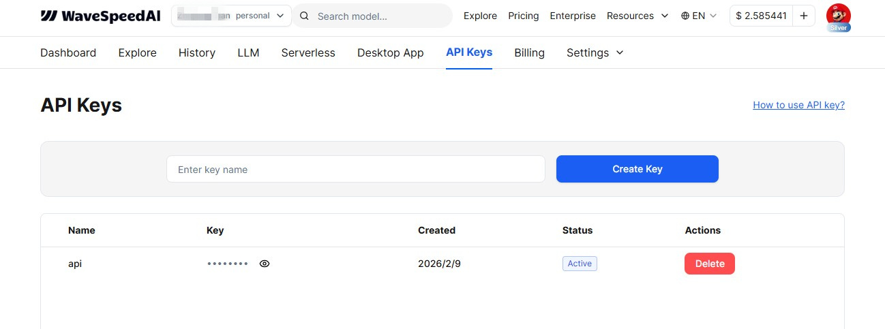
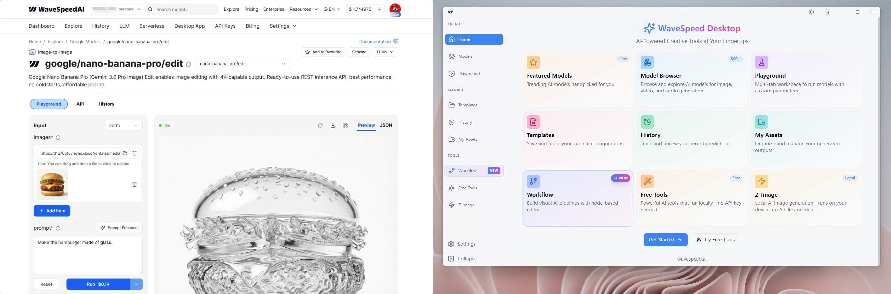
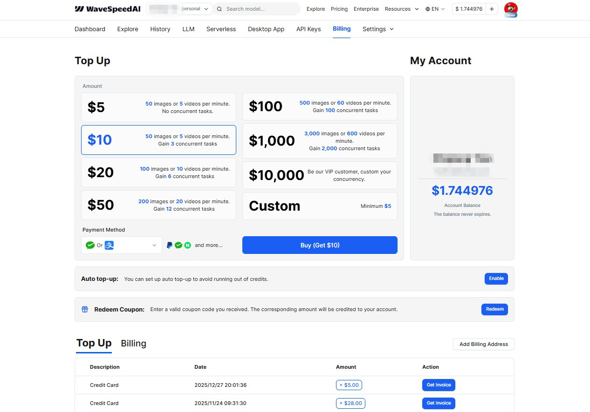

# 2026 Best LLM API Aggregation Platform Reviews

*Multimodal AI Model Aggregation Platform*

Looking for an AI aggregation platform with extensive multimodal models, reliable API access, competitive pricing, and stable service? Look no further—**[WaveSpeed AI](https://wavespeedai.pxf.io/QYO4Xz)** stands out as one of the best LLM aggregation platforms available. After using it extensively for several months, let me share what makes it exceptional.

## Singapore-Based Company

WaveSpeed AI is operated by WaveSpeedAI PTE.LTD, a Singapore-based company. Leveraging Singapore's unique geopolitical position, the platform capitalizes on its strategic location, economic advantages, and favorable policies amid the US-China AI competition. It avoids direct entanglement in trade and technology conflicts, and operates free from direct restrictions imposed by US export controls or China's data localization requirements. Serving as a super node connecting Eastern and Western computing power, data, and algorithms, WaveSpeed AI provides a neutral testing ground that combines security, compliance, and cutting-edge technology for global developers. This enables free integration of the world's best AI models to serve both individual and enterprise users—this is its core competitive advantage.

## Account Registration & Login

**[Visit WaveSpeed AI Official Website](https://wavespeedai.pxf.io/QYO4Xz)**. Currently, the platform supports direct login via Google or GitHub accounts.

## Extensive Model Collection

WaveSpeed AI aggregates dozens of world-leading AI models, including: Grok, SeedDance, Wan, Qwen, Kling, OpenAI, SeedDream, Dreamina, Flux, MiniMax, Google Gemini, Runway, Hunyuan, and many more. When expanded to specific variants, there are hundreds of models available. For most users, the resources are so abundant that it's impossible to use them all!

### Audio & Video Models Pricing Table

| Model Name | Category | Price (USD) |
| :--- | :--- | :--- |
| vidu/image-to-video-q1 | Image-to-Video | $0.4000 |
| vidu/text-to-video-q1 | Text-to-Video | $0.4000 |
| kwaivgi/kling-v1.6-i2v-pro | Image-to-Video | $0.4500 |
| vidu/q3/start-end-to-video | Image-to-Video | $0.3500 |
| vidu/q3-turbo/start-end-to-video | Image-to-Video | $0.3000 |
| vidu/start-end-to-video-2.0 | Image-to-Video | $0.3000 |
| vidu/image-to-video-2.0 | Image-to-Video | $0.3000 |
| vidu/text-to-video-2.0 | Text-to-Video | $0.3000 |
| kwaivgi/kling-v1.6-i2v-standard | Image-to-Video | $0.2500 |
| kwaivgi/kling-v1.6-t2v-standard | Text-to-Video | $0.2250 |
| vidu/image-to-video | Image-to-Video | $0.2000 |
| vidu/text-to-video | Text-to-Video | $0.2000 |
| vidu/start-end-to-video-q2-pro | Image-to-Video | $0.1500 |
| higgsfield/dop/image-to-video | Image-to-Video | $0.1250 |
| z-ai/glm-image/edit | Image-to-Image | $0.1200 |
| wavespeed-ai/hunyuan-image-3 | Text-to-Image | $0.1000 |
| pixverse/swapportrait | Transfer | $0.0900 |
| reve/remix | Image-to-Image | $0.0400 |
| reve/edit | Image-to-Image | $0.0400 |
| vidu/reference-to-image-q2 | Image-to-Image | $0.0400 |
| leonardoai/phoenix-1.0 | Text-to-Image | $0.0380 |
| minimax/music-v1.5 | Text-to-Audio | $0.0300 |
| decart/lucy-edit-dev | Video-to-Video | $0.0300 |
| wavespeed-ai/flux-srpo | Text-to-Image | $0.0250 |
| wavespeed-ai/flux-srpo/image-to-image | Image-to-Image | $0.0250 |
| wavespeed-ai/flux-1-srpo | Text-to-Image | $0.0250 |
| nvidia/chrono-edit | Image-to-Image | $0.0200 |
| decart/lucy-restyle | Video-to-Video | $0.0100 |
| wavespeed-ai/openai-whisper-with-video | Speech-to-Text | $0.0010 |
| wavespeed-ai/qwen-image-2512-lora-trainer | Training | $1.0000 |

### LLM (Large Language Models) Pricing Table

| Model Name | Input Price ($/M tokens) | Output Price ($/M tokens) | Context Length | Notes |
| :--- | :--- | :--- | :--- | :--- |
| anthropic/claude-opus-4.6 | 5.5 | 27.5 | 1,000,000? | Latest top-tier flagship, perennial top contender |
| anthropic/claude-sonnet-4.5 / 4.6 | 3.3 | 16.5 | 1,000,000 | Most popular balanced model |
| google/gemini-3-pro-preview / 3.1-pro | 2.0–2.2 | 12.0–13.2 | 1,048,576 | Long context + multimodal leader |
| openai/gpt-5.2-pro / gpt-5.2 | 1.9–23.1 | 15.4–184.8 | 400,000 | OpenAI's latest flagship series |
| x-ai/grok-4 / grok-4.1-fast | 0.22–3.3 | 0.55–16.5 | 256,000–2M | One of the strongest reasoning models, rapidly growing usage |
| z-ai/glm-5 / glm-4.7 | 0.39–1.1 | 1.6–3.5 | ~200k | One of China's strongest open-source models |
| moonshotai/kimi-k2.5 / kimi-k2 | 0.42–0.60 | 2.1–3.0 | 262,144 | Exceptional value + strong reasoning |
| minimax/minimax-m2.5 / m2.1 | 0.30 | 1.0–1.2 | ~200k | Latest MiniMax flagship |
| qwen/qwen3-max / qwen3-235b-a22b | 0.22–1.3 | 0.66–6.6 | 40k–1M | Latest Qwen series |
| deepseek/deepseek-v3.2 / deepseek-chat | 0.28–0.33 | 0.42–1.3 | 163,840 | Exceptional value reasoning model |
| meta-llama/llama-4-scout / maverick | 0.09–0.17 | 0.33–0.66 | 327k–1M+ | Ultra-long context open-source leader |
| google/gemini-2.5-flash / 3-flash | 0.11–0.33 | 0.44–2.8 | 1,048,576 | Fastest/cheapest long context |
| xiaomi/mimo-v2-flash | 0.10 | 0.32 | 262,144 | Xiaomi's latest fast model |
| qwen/qwen3-coder-next / coder-plus | 0.08–1.1 | 0.33–5.5 | 128k–262k | One of the strongest coding series |
| mistralai/mistral-large-2512 | 0.55 | 1.6 | 262,144 | Mistral's latest flagship |

*Prices are subject to change. Please refer to the official website for the most current pricing.*

## Pay-As-You-Go Pricing, Exceptional Value

Unlike the typical $20/month subscription model, WaveSpeed AI uses a pay-as-you-go pricing structure. For example, generating a 4K high-resolution image using Google's Nano-Banana-Pro model costs only $0.24—exceptional value for money. The platform provides detailed billing records. Below is my usage and billing statistics from the past month:

## API Access for Easy Integration

Create API keys for local or remote integration into your applications.

## Web & Desktop Apps for Maximum Flexibility

Users can operate directly through the WaveSpeed web interface to generate images and videos, or download the official desktop client for local operation. Desktop clients are available for Windows, macOS, and Linux.

The desktop client also provides dozens of free AI tools for images and videos, including Z-Image, which can run locally without requiring API calls.

## Multiple Payment Options

Before using WaveSpeed, you'll need to add credits to your account. The minimum deposit is $5. The platform supports major international payment methods including Visa/Mastercard credit cards, Alipay, WeChat Pay, and PayPal. Detailed transaction records are provided. The more you spend, the higher your account tier becomes, unlocking longer video processing capabilities and higher concurrency limits across four membership levels.

---

**[Sign Up for WaveSpeed AI Today and Access the Most Advanced AI Models!](https://wavespeedai.pxf.io/QYO4Xz)**

---

© 2026 WaveSpeed AI Platform Review · Content curated by the author

*Note: This is a third-party review page. All products and services are subject to WaveSpeed AI's official website.*